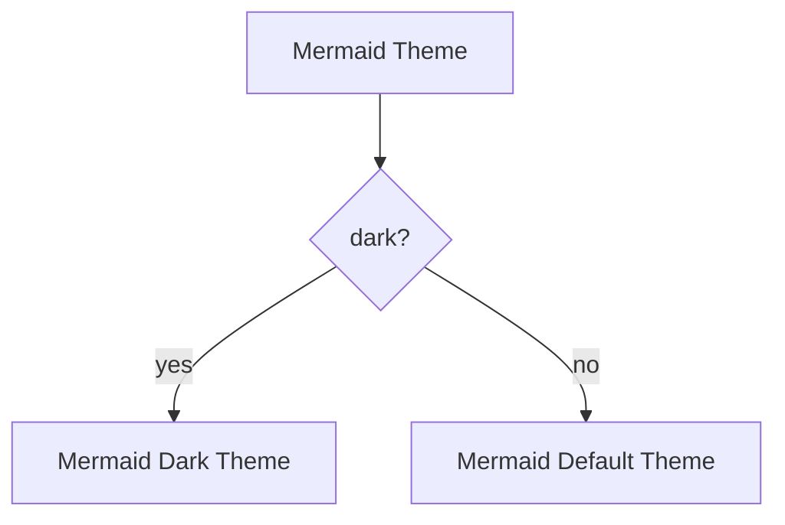

## Mermaid Theme

切换下方主题后，编辑器会重新初始化 `bytemd-plugin-mermaid`，用于观察 Mermaid 原生主题差异。

```mermaid
flowchart TD
A[Mermaid Theme] --> B{dark?}
B -->|yes| C[Mermaid Dark Theme]
B -->|no| D[Mermaid Default Theme]
```
